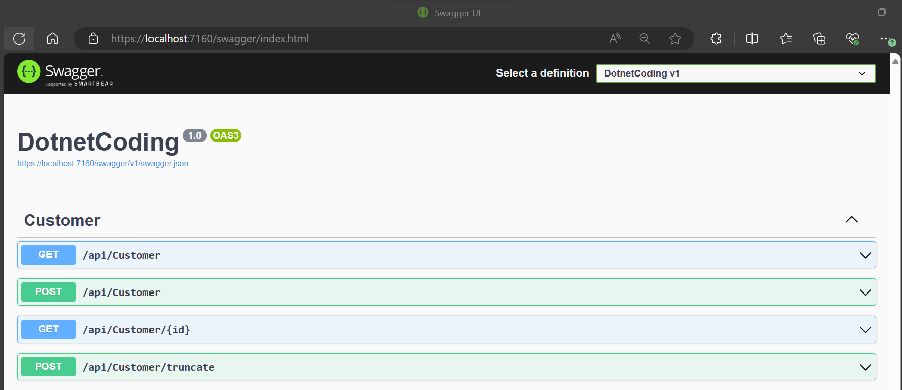
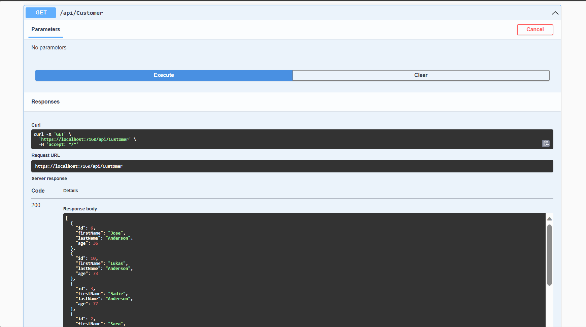
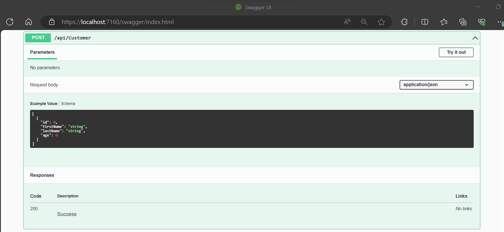
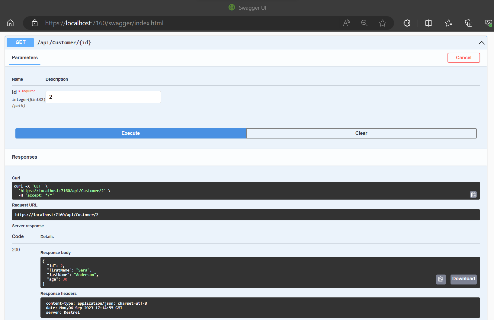
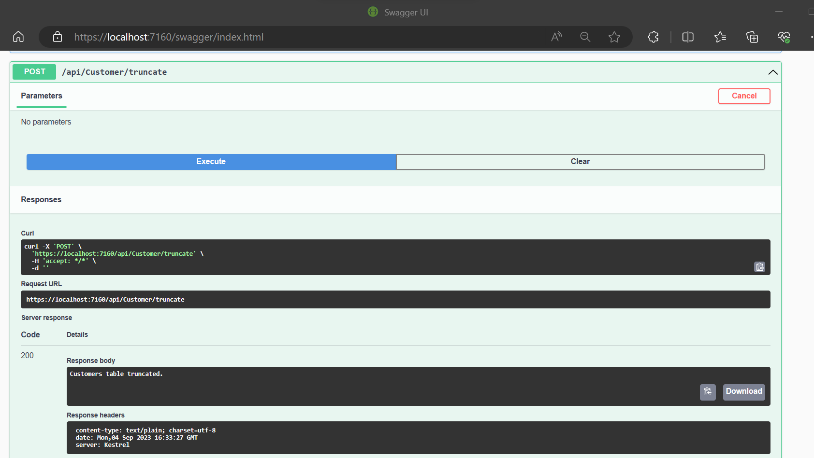

## REST Server to GET & POST Customers

For this server I'm using SQLite database for the backend web api to persist the data so that the data remains intact even after the restart of Web API Server. I chose SQLite for the ease of integration into my IDE and simpler configurations.

Following are the API's I'll be communicating with from the simuldator which will make various POST requests to add Customers.

### Following is the demonstration of GET Request.

The Customers fetched would be in the order of sorted by last name and then by first name

### Following is the format of POST Request.

The POST request to add Customers expects a list by which we could add multiple customers to the database with one request.

Simulator communicates with POST request to send customers in the batches of 2 to be added to the database.

POST has 3 status code:

- 200: Notifying all the Customers in the List were added
- 206: Notifying Customers are added partially and it gives out the error message for Customers with validation errors (Used ID, Age under 18, Null, first name null, last name null)
- 400: Notifying a bad request. That is all the Customers in a list weren't added.

### GET Request to fetch Customer by ID.

This API fetches a customer from the database based on an input ID.

### Truncate POST Requests for testing purposes.

I've added a POST requests to truncate the database for ease of testing. I added for the ease of debugging to keep my database empty to check which customers are getting added.

