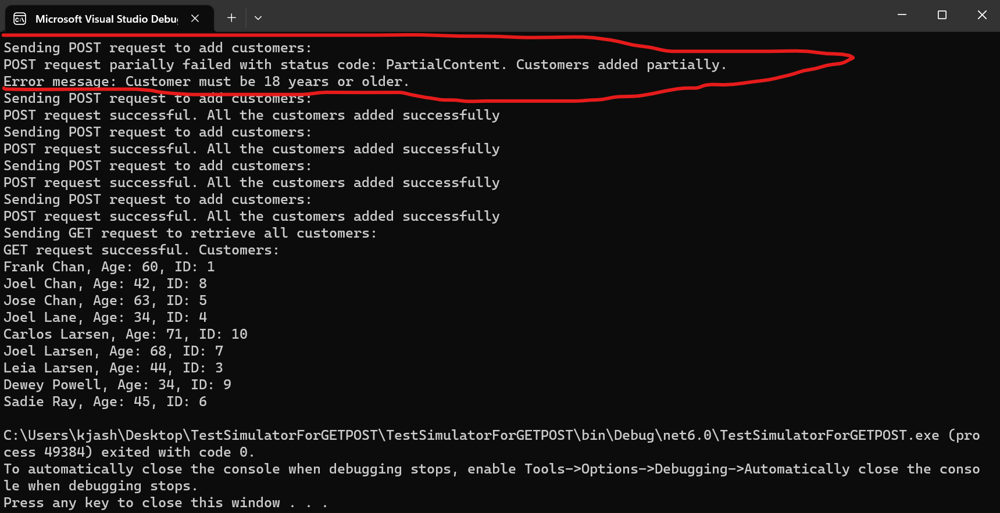

# Customer REST API Simulator with HTTP Client

1. This program makes a POST request to add Customer. Every POST request would post a list of two random customers with the data given in appendix. The age would be generated randomly in the range of 10-90. The simulator maker 5 POST request with a list of 2 randomly generated Customers. So on one run the simulator attempts to add 10 customers.
2. This program simulates to add customer with ID being 1 when the program runs and on every attempt of adding a customer the id would be increased by 1 after the request.
3. If attempted to add customers again with simulator the backend api would throw an error because the Customer with ID 1 and so on might exist in the database from previous runs of simulators. I used Truncate api for testing purpose, which would remove the data from the server to run the simulator again.
4. Lastly, the simulator makes a GET request to fetch all the Customers. The response would be Customer sorted by last name and then by first name.

- Here randomly generated age was less than 18 for Customer with ID: 2 in first POST request. So the API return Partial Content response with Status Code 206. 
- All the other request the customers generated randomly were valid so the request was successful.
- Lastly, the GET request fetched all the customers but to notice, the customer with ID:2 would be missing as the content wouldn't be added as the age < 18.